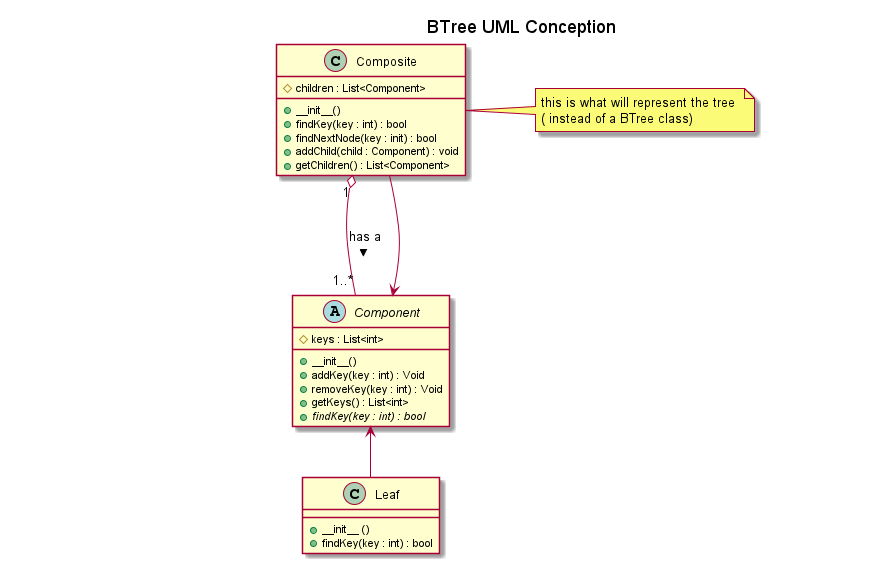

# projet-BTree

## Binome

- TAHIR Narimane 
- DALHOUMI Hamza
- groupe 2

## Rapport :

- Réalisation Structure d’arbre-B en UML et en Python a été faite 
- Réalisation Algorithme de recherche et codage en Python a été faite 

## Diagramme UML

  

